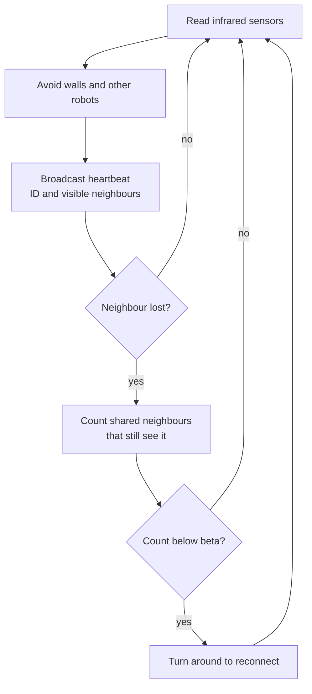

# Swarm-Robot-Simulation

My BSc dissertation at the University of Manchester: "Simulation and Optimization of the Beta-Algorithm for Autonomous Swarm Robotics". The full write-up is in `Swarm-Robot-Simulation-Report.pdf`.

A robot swarm is a group of simple robots that coordinate through local communication instead of a central controller. The beta algorithm is a rule that keeps such a swarm connected.

## Problem and approach

Robots in a swarm only talk to nearby neighbours, so the group can drift apart and lose contact. The beta algorithm limits that drift.

1. Each robot broadcasts a heartbeat message with its ID and the robots it can see.
2. When a robot loses contact with a neighbour, it counts how many shared neighbours can still see that neighbour.
3. If the count falls below a threshold, beta, the robot turns around to reconnect.

I simulated this in Webots, an open-source robot simulator, with the e-puck robot (a small wheeled research robot with infrared sensors). The controller is written in C. It combines Braitenberg-style obstacle avoidance (steering from raw sensor readings), the heartbeat messages and the beta rule, with extra logic so robots escape corners of the square arena.

## Architecture

## Results

I tested beta values of 1, 2, 3 and 5 and judged how long the swarm stayed together and evenly spread, using the distance between pairs of robots.

- Beta = 2 gave the best result. Most pairs stayed 30 to 35 cm apart for about 1 minute 20 seconds, and few robots left the group.
- Beta = 1 kept the swarm together only briefly, and the spread became uneven.
- Beta = 3 kept coherence but let some robots break away.
- Beta = 5 was weaker, with more robots out of formation.

Every run ended when the Webots controller crashed, so the runs were short and may hide the full effect of beta. The report has the method, figures and caveats.

## Run it

TODO: the Webots world file and the C controller are not in this repo, so the simulation cannot be run from here yet. I will add them with run instructions. Until then the report is the deliverable.

## Limitations and next steps

- Controller crashes cut every experiment short. The experiments used a small swarm in a square arena, and my laptop limited how many robots I could simulate.
- Webots made logging swarm data awkward, so I built custom logging.
- Next steps: keep the swarm tighter, use situated communication (messages tied to where robots are), try other swarm shapes, and test on physical robots.

I thank my supervisor, Prof. Clare Dixon, for her guidance.

## Screenshot

TODO: add a screenshot or GIF of the Webots simulation.
